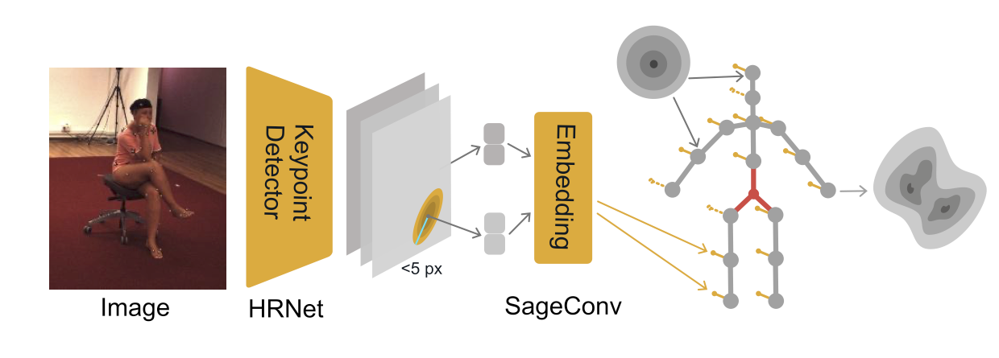

# Conditional Graph Normalizing Flows
This is the official implementation of the paper "Conditional Graph Normalizing Flows".

<p align="center"></p>

> [**Conditional Graph Normalizing Flows**](),\
> Pierzchlewicz, P. A., Cotton, R. J., Bashiri, M. & Sinz, F. H.

### cGNF Model Implementation
The Conditional Graph Normalizing Flows (cGNFs) is implemented as part of the [PROPOSE](https://github.com/sinzlab/propose/tree/0.1.0) framework for PRObabilistic POSe Estimation.
You can find the full implementation of the model [here](https://github.com/sinzlab/propose/tree/0.1.0/propose/models/flows).

## Getting Started
### Prerequisites
This project requires that you have the following installed:
- [docker](https://docs.docker.com/get-docker/)
- [docker-compose](https://docs.docker.com/compose/install/)

Ensure that you have the base image pulled from the Docker Hub.
You can get the base image by running the following command:
```shell
docker pull sinzlab/pytorch:v3.9-torch1.9.0-cuda11.1-dj0.12.7
```

### Step-by-step Installation Guide
1. Clone the repository.
2. Navigate to the project directory. 
3. Build the environment with `docker-compose build base`.
4. Add the necessary data as described in the [Data section](#data).

## Data
### Human3.6M dataset
Due to license restrictions the dataset is not included in the repository.
You can download it from the official [website](http://vision.imar.ro/human3.6m).

Download the *D3 Positions mono* by subject and place them into the `data/human36m/raw` directory.
Then run the following command to preprocess the data accordingly.
```
docker-compose run preprocess --human36m
```

## Results Reproduction

### Available Pretrained Models
We provide pretrained model weights which you can either download with the provided link or directly load with the following code snippet.
```python
from propose.models.flows import CondGraphFlow

flow = CondGraphFlow.from_pretrained("ppierzc/cgnf/cgnf_human36m-xlarge:best")
```
Table of available models:

| Model Name                  | description                                                                    | Artifact path                                | Weights |
|-----------------------------|--------------------------------------------------------------------------------|----------------------------------------------| ------- |
| Extra Large cGNF Human 3.6m | Extra large model trained on the Human 3.6M dataset with MPII input keypoints. | ```ppierzc/cgnf/cgnf_human36m-xlarge:best``` | [link](https://wandb.ai/ppierzc/propose_human36m/artifacts/model/mpii-prod-xlarge/v20/files) |
| Large cGNF Human 3.6m       | Large model trained on the Human 3.6M dataset with MPII input keypoints.       | ```ppierzc/cgnf/cgnf_human36m-large:best```  | [link](https://wandb.ai/ppierzc/propose_human36m/artifacts/model/mpii-prod-large/v20/files) |
| cGNF Human 3.6m             | Model trained on the Human 3.6M dataset with MPII input keypoints.             | ```ppierzc/cgnf/cgnf_human36m:best```        | [link](https://wandb.ai/ppierzc/propose_human36m/artifacts/model/mpii-prod/v20/files) |


### Training
You can rerun the training script with any of the model setups given in `/experiments/human36m` with the following command:
```
docker-compose run train --human36m --experiment=mpii-prod-xlarge
```
### Evaluation
#### Error Analysis between predictions and ground truth
You can evaluate the model with the following command:
```
docker-compose run eval --human36m --experiment=mpii-prod-xlarge
```

#### Calibration check of Model on the Human3.6M Dataset
You can run the calibration check with the following command:
```
docker-compose run eval --human36m --experiment=mpii-prod-xlarge --script=eval.human36m.calibration
```

### Plots
The code for plotting the results is available in the `/notebooks/` directory.
You can run the notebook server with the following command:
```
docker-compose run notebook_server
```
which will start a jupyter notebook server at https://localhost:8888.

## Try it yourself
We provide a demo of the model where you can provide your own input image and evaluate the model on it.
You can run the demo with the following command:
```
docker-compose run demo --human36m --experiment=mpii-prod-xlarge
```
Then you can open the demo in your browser at http://localhost:7860.

## Citing our work
If you use our work in your research, please cite our paper:
```
@article{
  pierzchlewicz_2022,
  title = {Conditional Graph Normalizing Flow},
  author = {Pierzchlewicz, Paweł A., Cotton, James, Bashiri, Mohammad, Sinz, Fabian},
  journal = {arXiv},
  year = {2022},
  url = {}
}
```